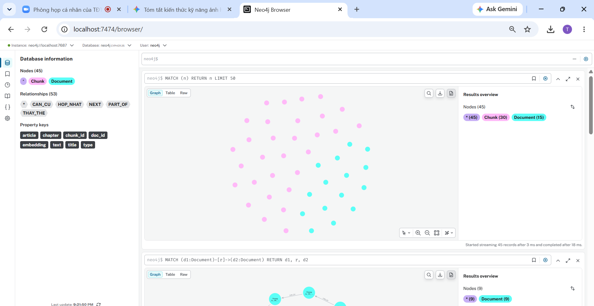
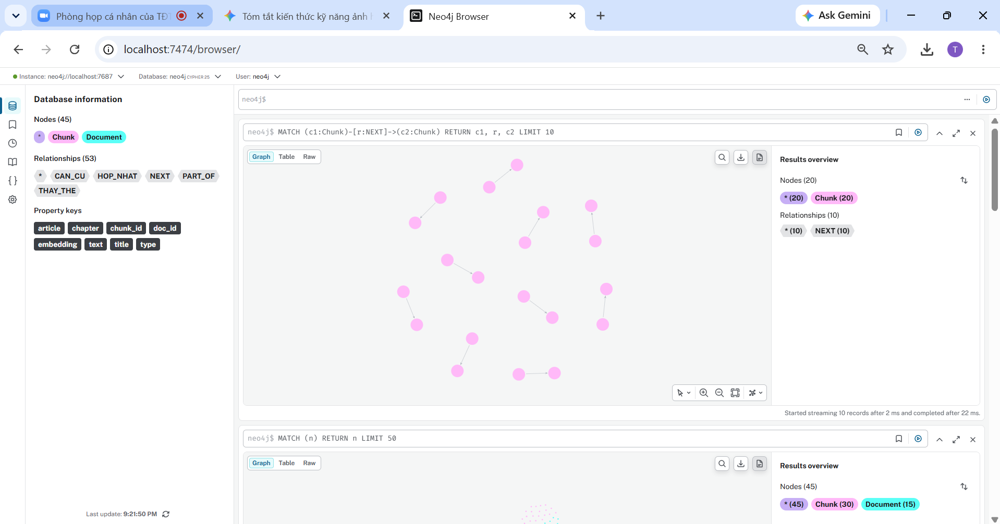
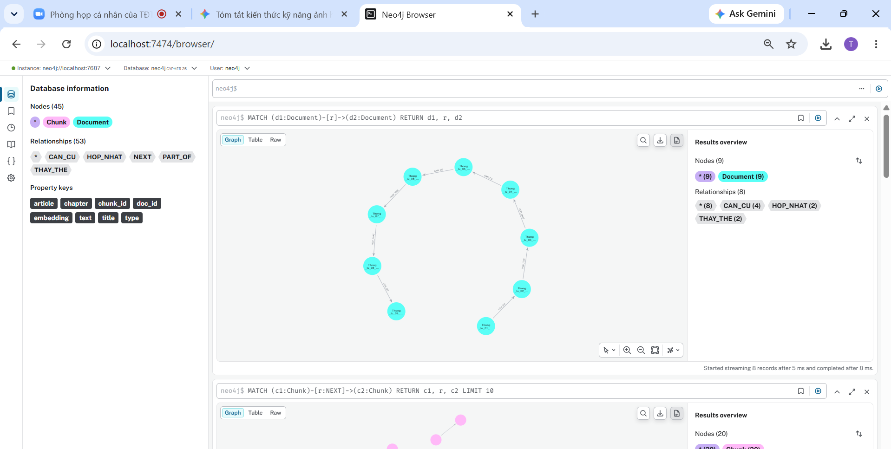

# Báo Cáo Thực Hành Buổi 10: Graph Ingestion & Dense Embedding

## 1. Kết Quả Xác Minh Cơ Sở Dữ Liệu Neo4j (Step 5 Verification)

## 2. Kiểm Tra Mẫu Các Nút Chunk & Vector Embedding (384 Dimensions)

## 3. Cấu Trúc Thư Mục Dữ Liệu Lab
